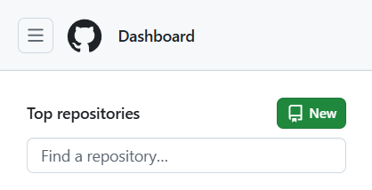
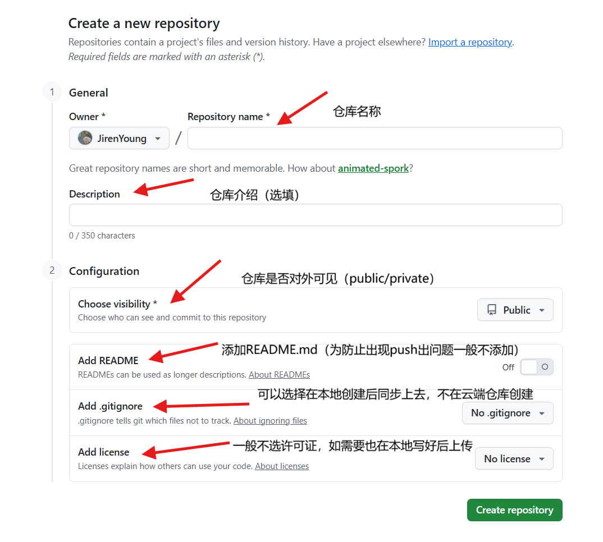
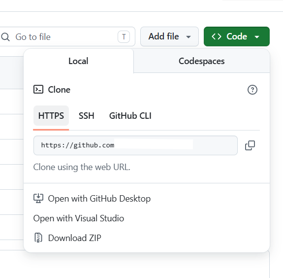
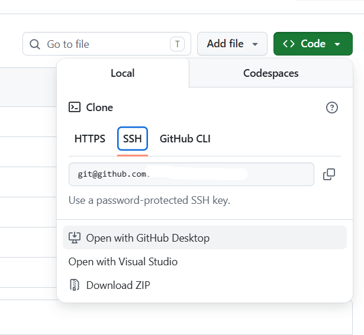

# 如何下载安装Git
Windows：
在[Git - Install for Windows](https://git-scm.com/install/windows)来选择Git For Windows/x64SetUp
或者在Windows自带终端里面使用
```terminal
winget install --id Git.Git -e --source winget
```
Mac:没有电脑不会，去看官网[Git - 安装 Git](https://git-scm.com/book/zh/v2/%e8%b5%b7%e6%ad%a5-%e5%ae%89%e8%a3%85-Git)
Linux：
如果你想在 Linux 上用二进制安装程序来安装基本的 Git 工具，可以使用发行版包含的基础软件包管理工具来安装。 以 Fedora 为例，如果你在使用它（或与之紧密相关的基于 RPM 的发行版，如 RHEL 或 CentOS），你可以使用 `dnf`：

```console
$ sudo dnf install git-all
```

如果你在基于 Debian 的发行版上，如 Ubuntu，请使用 `apt`：
```console
$ sudo apt install git-all
```
# 如何使用Git
Windows上安装完成会出现三个软件
- GitBash：最常用，支持Linux如ls类命令
- GitCMD：老古董，现在没人用，不支持Linux命令
- GitGUI：凑数的，没人用
## GitBash
这是最常用的Git命令行，可以打开GitBash进行Git版本管理，也可以选择直接在终端里直接输入
### Git版本管理创建
```shell
git init 
# 这是创建git版本管理的第一步，差不多类似告诉系统，这里由Git管理了，这是版本控制的第一步 
```
在执行完后会出现一个隐藏文件夹

那么在创建了.git的隐藏文件夹之后意味着git创建成功
### Git注册签名
这一步是为了确定在团队协作中不同的分支是由谁负责的
```shell
git config --global user.name "填名字" 
git config --global user.email "填邮箱"
#如果本地不协作，这里的名字邮箱无所谓，如果要上传到github建议和github邮箱一致
#这里global是全局配置不用每次设定name和email
```
### 查看Git注册签名配置
```shell
git config --global --list
```
### main或master分支创建
```shell
git add .
git commit -m "这里写改动了什么，比如这是主线"
#创建主线
#注意，一定要看清楚你创建的是main还是master主分支，这将影响你后续第一次推送的名称
```
### 创建分支
```shell
git checkout -b name
# 这里的name可以被替换，这就是分支名称
```
### 查看分支
```shell
git branch
# 带*的是当前分支
```
### 分支提交
```shell
git add .
git commit -m "这里写改动了什么，比如这是分支功能"
#分支提交
```
### 分支合并
```shell
#首先切回main或master
git checkout main
git merge name
#这里的name是分支名称
git branch -d name
#如果-d报错，那就-D来强制删除
#合并进main并不能自动删除支线所以要手动删除
```
以上的是基于本地单人版本管理
# 如何在GitHub上创建仓库
怎么创建github账户不过多赘述，如果打不开github，使用加速器或更改dns
```shell
#阿里的DNS
223.5.5.5
223.6.6.6
```
点击New来创建仓库




如何获取绑定仓库的链接

点击Code然后复制Https和SSH中任选一个复制即可





# 如何使用Git同步到GitHub/Gitee
## 绑定仓库
### HTTPS绑定：
```shell
git remote add origin 你的仓库https地址
```

### SSH配置及绑定：
```shell
# SSH 密钥配置（一次配置，永久免密） 
# 1. 生成密钥（邮箱填你的 GitHub 邮箱） 
ssh-keygen -t ed25519 -C "你的GitHub邮箱" 
# 2. 一路回车，不需要设置密码 
# 3. 找到公钥 Windows 路径，用记事本打开，复制全部内容 ，直接复制代码也可以
notepad C:\Users\你的用户名\.ssh\id_ed25519.pub

# 4. 粘贴到 GitHub GitHub → Settings → SSH and GPG keys → New SSH key 粘贴公钥 → 保存
git remote add origin 你的仓库的ssh地址
```
### 查看绑定是否成功
```shell
git remote -v
```
## 同步仓库
### 同步到单个仓库
```shell
# 1. 添加改动 
git add . 
# 2. 提交版本 
git commit -m "本次更新说明" 
# 3. 第一次推送（必须带 -u） 
git push -u origin main 
# 这里的main取决于你创建的主分支是main还是master
# ------------------------------ 
# 若报错：远程有文件本地没有（如 LICENSE） 
# 方案1：安全合并 
git pull origin main --allow-unrelated-histories 
git push 
# 方案2：强制覆盖云端（最快） 
git push -f
```
### 同步到多个仓库
```shell
git remote set-url --add origin 第二个仓库地址
git push
```
### 解除 / 更换远程仓库
```shell
git remote remove origin
```
### 拉取远程最新代码
```shell
git pull
```

> [!NOTE] 提醒
> Git推上云端失败概率太高了，不成功就多尝试几遍


